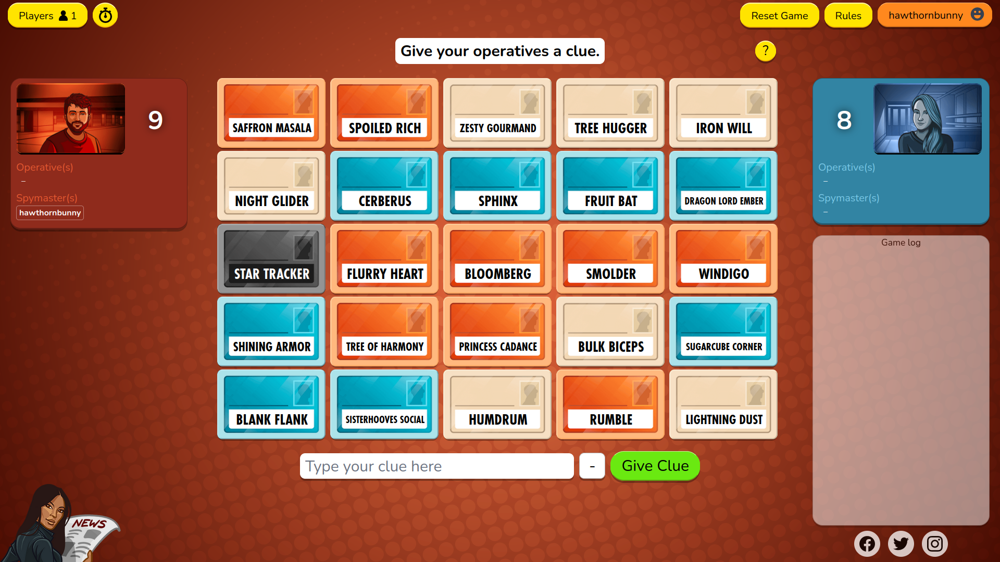

# mlp-codenames

## Short version
This is a set of _My Little Pony_-themed word pack files for you to download and use in the online version of _Codenames_ (<https://codenames.game/>).

The following word packs are available:

* [fim-common.txt](fim-common.txt): A set of 300+ words containing characters and concepts from the _My Little Pony: Friendship is Magic_ TV series only. The word selection is designed not to be too obscure and should only require general knowledge gained from watching the show.
* [g4.txt](g4.txt): A set of 550+ words covering the entirety of _My Little Pony_ Generation 4, including _Friendship is Magic_, _Equestria Girls_, _My Little Pony: The Movie_ (2017), _Rainbow Roadtrip_, _Pony Life_, and the IDW comics. May include obscure characters and concepts. Recommended for knowledgeable fans of MLP Generation 4.
* [g5.txt](g5.txt): A set of 90+ words pertaining to _My Little Pony_ Generation 5 only, starting with the 2021 movie _My Little Pony: A New Generation_ and including _Make Your Mark_, _Tell Your Tale_ and the 2022 video game _My Little Pony: A Maretime Bay Adventure_.
* [g4-and-g5.txt](g4-and-g5.txt): A combination of the G4 and G5 sets.

## Long version

### What is this?
A small collection of _My Little Pony_ themed word pack files for the online version of the board game _Codenames_, plus some convenience tools to make the word packs easier to curate.

### What's _Codenames_?
[_Codenames_](https://czechgames.com/en/codenames/) is a competitive board game by Czech Games Edition. The game consists of a grid of 25 randomly-selected words (the "codenames"), some of which belong to your team and some of which belong to the opposing team. Only the Spymaster of each team knows which words are theirs. The Spymaster's job is to give limited clues to try to help their team figure out which words are theirs, before the opposing team manages to find their own words.

This might sound simple, but in practice it is a fiendishly tense battle of communication, psychology, and lateral thinking, and it's an absolute blast to play live with others. It works very well played online, especially with voice chat. You need at least 4 players, although there's also a _Codenames Duet_ variant which works with only 2 players.

The online version of _Codenames_ (<https://codenames.game/>) is completely free and requires no sign-up - you can just create a room and invite people to play.

### What are word packs?
A word pack is a plain text file containing a set of words to be used in an online _Codenames_ game. _Codenames_ has several default word packs, but you don't have to use them; in the online version, you can supply a word pack file containing your own custom words and tell the game to use those instead.

### How do I use the word packs in an online Codenames game?
* Go to <https://codenames.game/>.
* Press the "Create Room" button.
* Enter a nickname and press "Create Room".
* Press "Full Settings".
* Under "Select which word packs to use:", press "Create your own custom word pack!"
* A "Create your own custom word pack" dialog should appear. Use the "Upload a file with words" interface to choose your word pack file.
* When uploaded, your list of custom words should appear in the text box. You can edit them if you want. If you're happy with them, press "Continue".
* To ensure that the game uses _only_ your custom words, make sure that "Codenames", "Codenames: Duet", and any other word packs are unticked.
* When your teams are ready to play, press "Start New Game".

### What if I don't know one of the words that comes up?
Given the breadth of MLP lore, it's likely that you'll come across references to some obscure character or concept that you don't know or can't remember. No worries - it's fine to look things up during a game. If you are one of the operatives, you can just ask if you're not sure. If you're a Spymaster, you can still make enquiries or look things up - just try to avoid giving away clues!

If players are finding it too difficult, consider using an easier word pack such as [fim-common.txt](fim-common.txt).

### Your word pack doesn't contain [X].
I've almost certainly missed a bunch of words - feel free to send suggestions and corrections to [hawthornrabbit@gmail.com](mailto:hawthornrabbit@gmail.com).

Some omissions are deliberate:
* I've tried to limit these word packs to official _My Little Pony_ content where possible. This includes favoring official names over fandom ones (eg. "DJ Pon-3" instead of "Vinyl Scratch").
* In some packs, I've omitted words that are too obscure or too similar to other words.

### Why no Generation 1 or 3?
I'd love to have word packs for these (or to incorporate them more thoroughly into an all-gens word pack) but I don't know these MLP generations well enough! If you can supply a word pack with at least 200 distinct items for either of these, feel free to send it to me.

### What are the scripts and "sources" for?
To make the word packs easier to manage and curate, I created several "source packs" which divide up the words into meaningful groups, and I wrote a Python script which compiles source packs into a finalised word pack. The source packs contain annotated lines beginning with `#`, which are removed during compilation.

If you're only interested in the word pack files, you can ignore the scripts and sources.

### Can I make my own modified version of these word packs?
Absolutely! These word packs are free to use and you can modify them however you want.

### I want to create a themed _Codenames_ word pack for a different fandom - do you have any tips?
Yes! Here are some guidelines:

* The most important rule for making _Codenames_ word packs is that _all items should be distinct concepts_. If you include two items that are too similar, Spymasters may find it impossible to make a clue that distinguishes them. When adding items to your word pack, try to think about how it relates to the pack as a whole.
* _Codenames_ recommends keeping items less than 12 characters for readability, but for themed word packs, I think it's fine to go over this limit, since it's pretty hard to express most themed concepts in under 12 characters. If an item is too long (somewhere around 20 characters), the game wraps it onto two lines, which looks ugly but is still perfectly readable. Abbreviating items is fine too if it's still clear what the item is referring to.
* Your choice of words is completely up to you, but consider your audience - who will be playing, and will they be familiar with most of your words? Remember that not everyone has the same reference pool and niche fandom references might fly over some people's heads.
* The online version of _Codenames_ requires that the word pack file has one item per line, has at least 25 items, isn't larger than 2MB, and that the file name ends in `.txt`.
